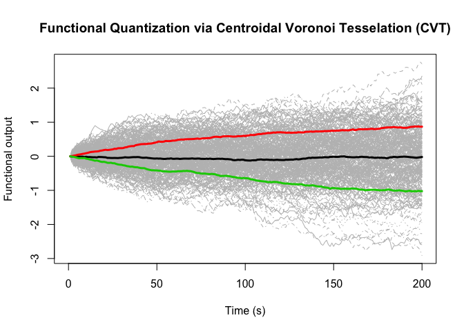

FunctQuant R Package
================
Reda El Amri
28/12/2020

## Description

This package contains functions that provide a greedy functional quantization and also the optimal grid (one shot algorithm). See my paper for more details: **Data-driven stochastic inversion via functional quantization** \[<https://link.springer.com/article/10.1007/s11222-019-09888-8>\].

When you click the **Knit** button a document will be generated that includes both content as well as the output of any embedded R code chunks within the document. You can embed an R code chunk like this:

## Including Plots

You can also embed plots, for example:

``` r
data <- t(BM(N = 200 - 1, M = 300))
size <- 3
mKL <- 2
quant <- GFQ(data,mKL,size,method="maximin",deepstart=TRUE)
```



``` r
quant <- GFQ(data,mKL,size,method="L2",deepstart=TRUE)
```


