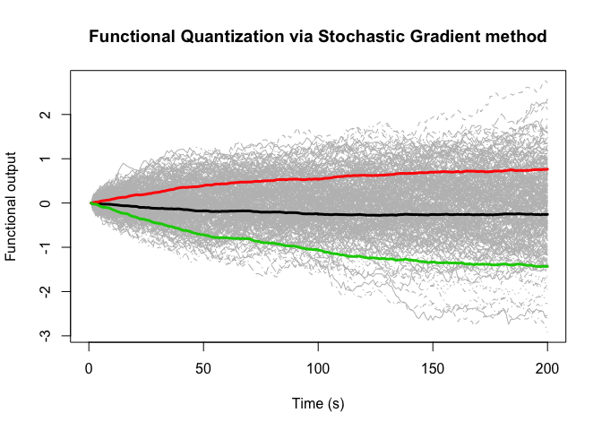
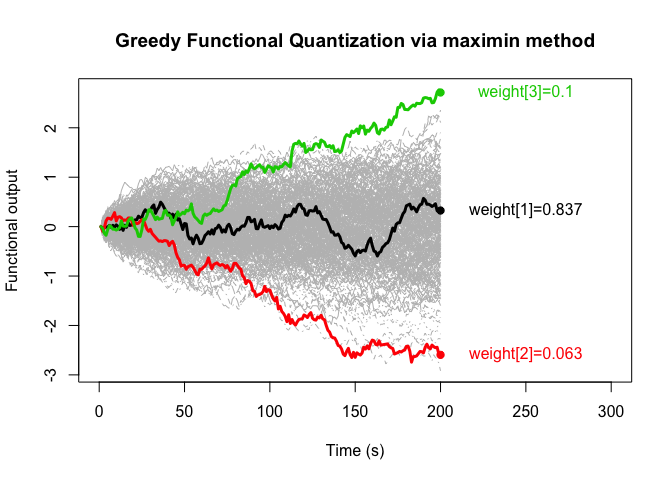

FunctQuant R Package
================
Reda El Amri
2018-02-27

## Description

This package contains functions that provide a greedy functional quantization and also the optimal grid (see my paper for more details <https://link.springer.com/article/10.1007/s11222-019-09888-8>).

## R funtions

Data-driven functional quantization with different approaches

``` r
data <- t(BM(N = 200 - 1, M = 300))
size <- 3
quant <- CVT(data,size,iter=22)
```


``` r
mKL <- 2
quant <- StochGradient(data,mKL,size)
```



``` r
quant <- GFQ(data,mKL,size,method="maximin",deepstart=TRUE)
```



``` r
quant <- GFQ(data,mKL,size,method="L2",deepstart=TRUE)
```


